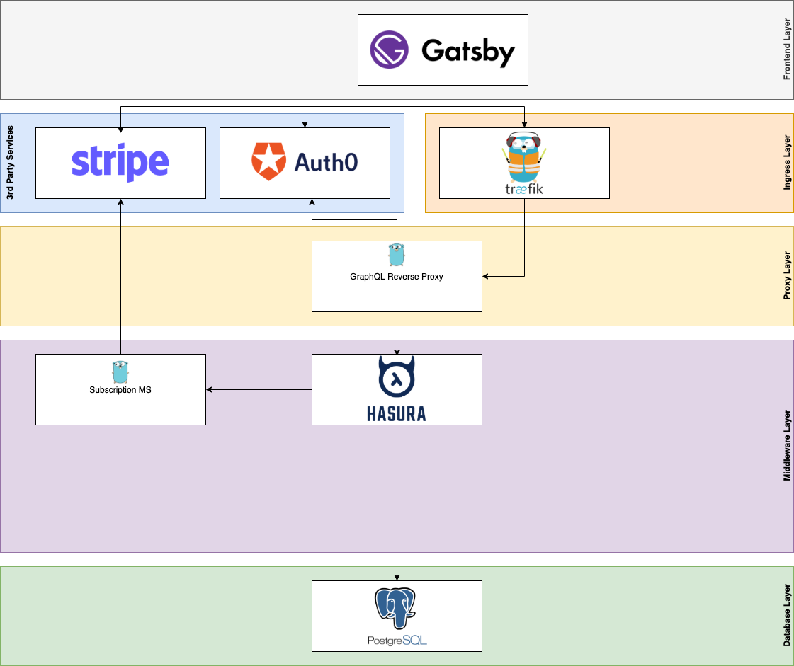

# Hasura SaaS

 
 

## About the project

This repository is an intent to create a set of microservices to be able to spin up a SaaS application backed by Hasura.

## Architecture

### Status

Work in progress

